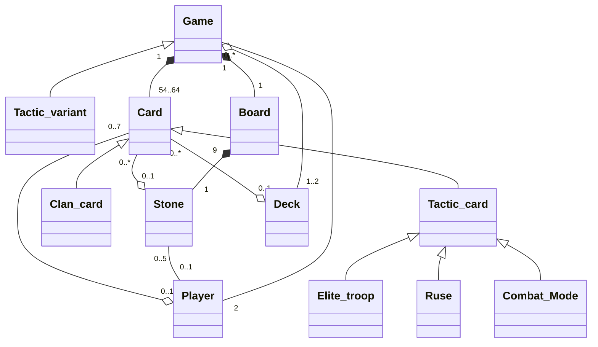

## UML version 1 :
Notre UML est porté de PlantUML vers markdown avec [mermaid](https://mermaid.js.org).
  
- [Syntaxe des diagrammes de classes avec mermaid](https://mermaid.js.org/syntax/classDiagram.html)
- [Liste des manières de l'utiliser](https://mermaid.js.org/ecosystem/integrations.html), perso j'utilise le plugin de Jetbrains
- [Ancien UML](https://codimd.math.cnrs.fr/VEjH14SwRfq9q9YtunKFbg?both)

### Changements :
- Ajout des "-", "+"...
- Ajout des relations entre les classes **, elles ne sont pas forcément claires, et pourront changer**
- `Stone_tiles` devient simplement `Stone`
- `Tactical` devient `Tactic` (cf règle en anglais)
- Héritage pour la classe `Game` avec la variante de jeu
- Tableau de bool pour savoir les _slots available_ dans la classe `Stone` 
- Création de la classe `Board` pour gérer la vie des `Stone`, car cela réduit le couplage à la Classe `Game` qui gère déjà la vie des `Card`
- Héritage pour les cartes avec `Card`.
- Enlever le lien entre `Player` et `Stone`
- Enlever les liens entre les cartes tactique, clans et `Game` car l'arité `"54" -- "1"` est explicit avec l'attribut `number_of_clan_cards`

> Notre UML va surement changer avec l'ajout de design pattern etc... 
> N'hésitez pas à le critiquer, et à le modifier

### #TODO
- Penser à un héritage avec une seule classe `Card` qui pourrait être utilisé `Deck`
- Ajouter les types des vaiables et de retour des fonctions 

```mermaid
---
title: Architecture Shotten-Totten
---
classDiagram


%% ------ Relations
    Card <|-- Tactic_card
    Card <|-- Clan_card
    Card "0..7" --o "0..1" Player
    Card "0..*" --o "0..1" Stone
    Clan_card "0..54" --o "0..1" Clan_deck
    Tactic_card <|-- Elite_troop
    Tactic_card <|-- Ruse
    Tactic_card <|-- Combat_mode
    Tactic_card "0..10" --o "0..1" Tactic_deck
    Deck <|-- Tactic_deck
    Deck <|-- Clan_deck
    Game <|-- Tactic_variant
    Game "0..*" -- "2" Player
    Game "1" *-- "1" Board
    Game "1" o-- "1..2" Deck
    Game "1" *-- "54..64" Card
    Stone "0..5" -- "0..1" Player
    Board "9" *-- "1" Stone

%%---------- Class
class Game {
    - clan_card_deck : Deck
    - board : Board
    - number_of_clan_cards = 54: const int
    + getNbClanCards()  int
    + setupGame()
}

class Tactic_variant {
    - tactic_card_deck : Deck
    - number_of_tactic_cards =10 : const int
    + getNbTacticCards()  int
    + setupGame()

}


class Board {
    - number_of_stone_tiles = 9 : const int
    - stone_tiles : Stone[number_of_stone_tiles]
    - winner : &Player
}


class Card
    

class Clan_card{
    - color : CardColor
    - value : int<1 to 9>
    + getColor() CardColor
    + getStrength() int
}

class Tactic_card{
    - name: string
    - description: string
    + getName() string
    + getDescription() string
}

class Elite_troop {
    
}
class Ruse {
    
}
class Combat_mode {
    
}
        
class Stone{
    - claimed : bool
    - winner& Player
    - slot_number = 3 : unsigned int
    - cardSlotsAvailable vector~bool~
    - tactic_slot : Card
    - player_1_combination: Card[slot_number]
    - player_2_combination:  Card[slot_number]
    + getNbStoneTiles() int
    + addCard()
}

class Player{
    -id: <1 or 2>
    - number_of_cards : int
    - hand : vector~Card~
    - max_cards : int<6 to 7>
    - claimed_stones : list ~bool~
    + getClaimed_stones()
    + play_card()
<<<<<<< Updated upstream
    + claim_stone_tiles()
    + getNumber_of_cards() 
=======
    + draw_card() Card
    + claimed_stone_tiles() 
    + getNumber_of_cards() int
>>>>>>> Stashed changes
}

class Deck{
    - cards: list~Card~
    - number_of_cards : int
    + isEmpty() bool
    + draw_card() Card
    + getNumber_of_cards() int
}

class Tactic_deck

class Clan_deck
    
    
class Score{
- score_p1: int
- score_p2: int
- round: int
+p1_gagne()
+p2_gagne()
}

%% note for Tactic_card  "Un joker ne peut être présent plus d'une\n fois d un même côté de la frontière"

%%-------- Enum class
class CardColor {
    <<Enumeration>>
    blue
    purple
    green
    red
    orange
    brown
}
    
<<<<<<< Updated upstream
%% ------ Relations
Game <|-- Tactic_variant
Card <|-- Tactic_card
Card <|-- Clan_card
Deck <|-- Tactic_deck
Deck <|-- Clan_deck
Card "0..7" --o "0..1" Player
Card "0..9" --o "0..1" Stone
Stone "0..5" -- "0..1" Player
Tactic_card "0..10" --o "0..1" Tactic_deck
Clan_card "0..54" --o "0..1" Clan_deck
Game "0..*" -- "2" Player
Game "1" *-- "1" Board
Board "9" *-- "1" Stone
Game "1" o-- "1..2" Deck
Game "1" *-- "54..64" Card
Tactic_card <|-- Elite_troop
Tactic_card <|-- Ruse
Tactic_card <|-- Combat_Mode
=======
>>>>>>> Stashed changes


```


