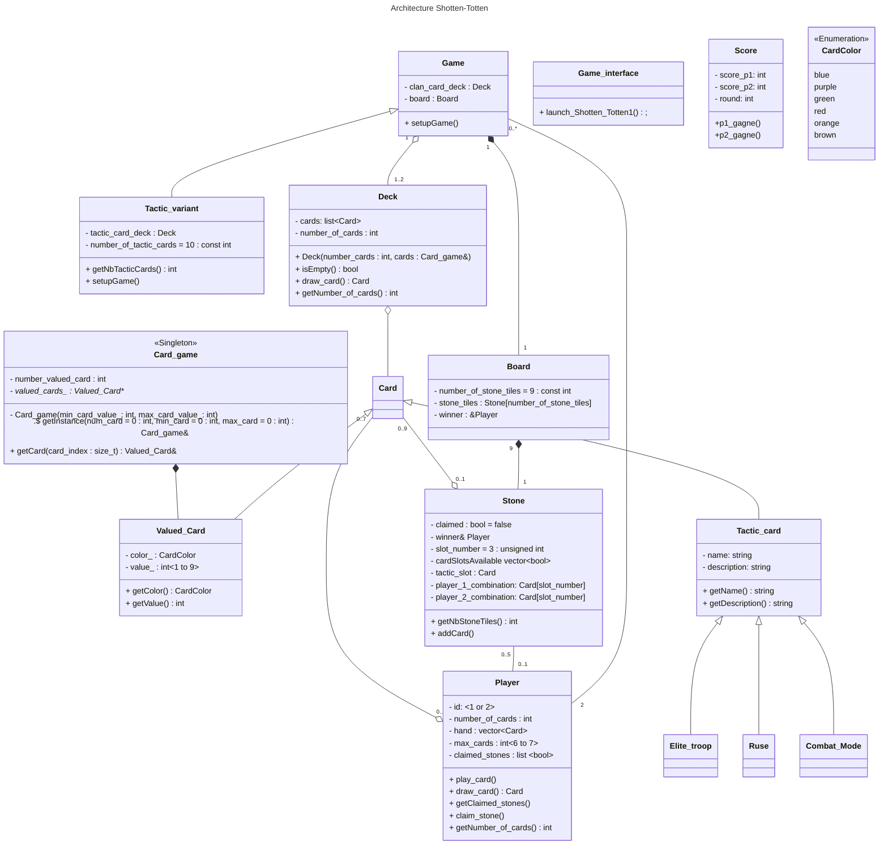
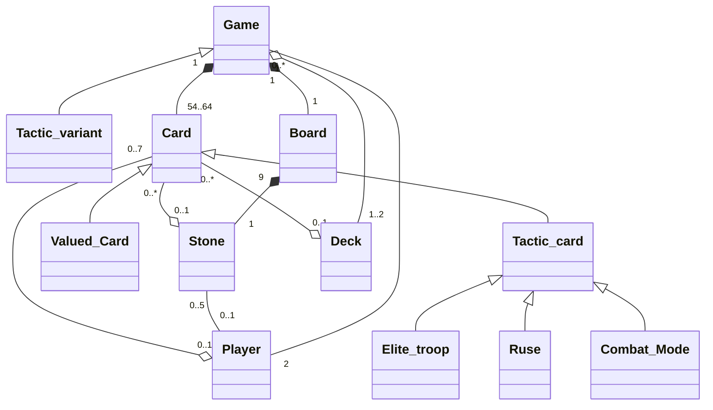

## UML version 1 :
Notre UML est porté de PlantUML vers markdown avec [mermaid](https://mermaid.js.org).
  
- [Syntaxe des diagrammes de classes avec mermaid](https://mermaid.js.org/syntax/classDiagram.html)
- [Liste des manières de l'utiliser](https://mermaid.js.org/ecosystem/integrations.html), perso j'utilise le plugin de Jetbrains
- [Ancien UML](https://codimd.math.cnrs.fr/VEjH14SwRfq9q9YtunKFbg?both)

### Changements :
- Ajout des "-", "+"...
- Ajout des relations entre les classes **, elles ne sont pas forcément claires, et pourront changer**
- `Stone_tiles` devient simplement `Stone`
- Tableau de bool pour savoir les _slots available_ dans la classe `Stone` 
- Création de la classe `Board` pour gérer la vie des `Stone`, car cela réduit le couplage à la Classe `Game` qui gère déjà la vie des `Card`
- Héritage pour les cartes avec `Card`.
- Enlever le lien entre `Player` et `Stone`

> Notre UML va surement changer avec l'ajout de design pattern etc... 
> N'hésitez pas à le critiquer, et à le modifier

