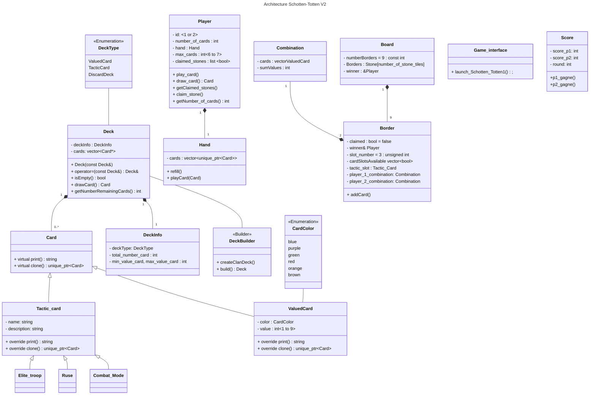

# Big Schotten-Totten

# Sommaire :

- [Liens utiles](#Liens-utiles)
- [Tâches à faire](#tasks)
- [UML](#uml-version-2)
- [Utilisation de Git](#Git)

## Liens utiles

- Le [Trello de l'équipe](https://trello.com/b/XQj4rIn7/shotten-totten "Trello LO21")
- Le [Rapport n°1](https://fr.overleaf.com/project/6419a39393e938ac5e40ea3e)(Overleaf)
  
**Ressources :**  
- [Refactoring guru](https://refactoring.guru) Explications BD des **designs patterns** et des **bonnes pratiques** du refactoring AKA *"comment écrire du **clean code**" ?* 
- [Grepper](https://www.grepper.com) : Extension web qui donne des petites solutions de code dans le navigateur (Faire ses recherches en anglais)  
  

  

# Tasks

- [x] `Deck`, `DeckBuilder` : @kilaposhi
- [x] `Card` : @kilaposhi
- [ ] `Player`
- [ ] `Border`
- [ ] `Board`
- [ ] [Rapport 2](documentation/rapport_2.md)

Faire les grosses classes de l'UML ci dessous:
[Lien vers les tâches précise](documentation/Tasks.md)
  
  
## UML version 2



[voir UML version 1](documentation/UML.md)  
  

## Git

[Aide sur l'utilisation de git ](documentation/aide_git.md)

# Avant-propos
```
                   (                                     
                   )\ )    )          )    )             
                  (()/( ( /(       ( /( ( /(   (         
                   /(_)))\())  (   )\()))\()) ))\  (     
                  (_)) ((_)\   )\ (_))/(_))/ /((_) )\ )  
                  / __|| |(_) ((_)| |_ | |_ (_))  _(_/(  
                  \__ \| ' \ / _ \|  _||  _|/ -_)| ' \)) 
                  |___/)_||_|\___) \__) \__|\___||_||_|  
                    ( /(      ( /( ( /(   (              
                    )\()) (   )\()))\()) ))\  (          
                   (_))/  )\ (_))/(_))/ /((_) )\ )       
                   | |_  ((_)| |_ | |_ (_))  _(_/(       
                   |  _|/ _ \|  _||  _|/ -_)| ' \))      
                    \__|\___/ \__| \__|\___||_||_|       
```

> This repository is under the **GNU General Public License v3.0**

# Crédits

Le Schotten-totten a été créé par Reiner Knizia et publié en 1999.