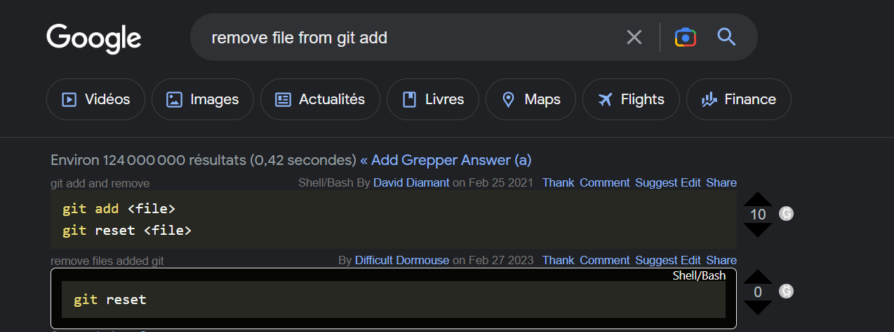

# Big Schotten-Totten

# Sommaire :

- [Liens utiles](#Liens-utiles)
- [Tâches à faire](#tasks)
- [UML](#uml-version-2)
- [Utilisation de Git](#Git)

## Liens utiles

- Le [Trello de l'équipe](https://trello.com/b/XQj4rIn7/shotten-totten "Trello LO21")
- Le [Rapport n°1](https://fr.overleaf.com/project/6419a39393e938ac5e40ea3e)(Overleaf)
- Le [Rapport 3](https://docs.google.com/document/d/1JnmKqo7RdC75wO17AeH6vWk4pL5y7H0QqZoP19NPSyg/edit?usp=sharing)

**Ressources :**
- [Refactoring guru](https://refactoring.guru) Explications BD des **designs patterns** et des **bonnes pratiques** du refactoring AKA *"comment écrire du **clean code**" ?*
- [Grepper](https://www.grepper.com) : Extension web qui donne des petites solutions de code dans le navigateur (Faire ses recherches en anglais)  
  


# Tasks

- [x] `Deck`, `DeckFactory` : @kilaposhi
- [x] `Card` : @kilaposhi
- [ ] `Player`
- [ ] `Border`
- [ ] `Board`
- [X] [Rapport 2](documentation/rapport_2.md)
- [ ] tacticCard
- [ ] [Rapport 3](https://docs.google.com/document/d/1JnmKqo7RdC75wO17AeH6vWk4pL5y7H0QqZoP19NPSyg/edit?usp=sharing)


Faire les grosses classes de l'UML ci dessous:
[Lien vers les tâches précise](documentation/Tasks.md)


 ```mermaid
 ---
title: Architecture Schotten-Totten V2
---
classDiagram

%% ------ Relations
Card <|-- TacticCard
Card <|-- ValuedCard
CardColor -- ValuedCard
TacticType -- TacticCard
Observer<|--GameTracker
Deck "1"*-- "0..*" Card
Deck -- DeckFactory
%%    Card "0..7" --* "0..1" Hand
  Combination "1" --* "2" Border
  Player "1"*--"1" Hand
  Combination "2" --* "1" Border
  Board "1" *-- "9" Border

%%---------- class
  class Game_interface{
    + launch_Schotten_Totten1();
  }

  class Card {
      <<abstact>>
    + virtual print() string = 0
  }


  class ValuedCard{
    - color : CardColor
    - value : int<1 to 9>
    + override print() string
    + getColor() CardColor
    + getValue() int
  }

  class TacticCard{
    - name: TacticType
    - description: string
    + override print() string
    + getName() TacticType
    + getDescription() string
  }


  class Board {
    - numberBorders = 9 : const int
    - Borders : Stone[number_of_stone_tiles]
    - winner : &Player
  }

  class Combination{
    - cards : vectorValuedCard
    - sumValues : int
    - type : CombinationType
    + computeCombination() : combinationType
  }

  class Border{
    - claimed : bool = false
    - winner* Player
    - slot_number = 3 : unsigned int
    - cardSlotsAvailable vector~bool~
    - tactic_slot : Tactic_Card
    - player_1_combination: Combination
    - player_2_combination:  Combination
    + addCard()
    + getCombination(Player& player) : Combination
  }

  class Player{
    - id: <1 or 2>
    - player: ptr~Player~
    - hand : vector~unique_ptr~Card~~
    - max_cards : int<6 to 7>
    - claimed_borders : vector~int~
    + play_card()
    + draw_card() Card
    + getClaimed_stones()
    + claim_stone()
    + getNumber_of_cards() int
  }

  class Deck{
    - cards: vector~Card*~
    + Deck(Deck&&)
    + operator=(Deck&&) Deck&
    + isEmpty() bool
    + drawCard() unique_ptr<Card>
    + putCard(card : unique_ptr<Card>)
    + getNumberRemainingCards() int
  }


class DeckFactory {
  <<Factory>>
  - number_cards int
  - number_colors int
  - min_card_value int
  - max_card_value int
  - setRangeValue(min_value: int, max_value: int)
  - setNumberColors(num_colors: int)
  - createValuedCard()
  - createTacticCard()
  - build() Deck
  + createClanDeck() Deck
  + createTacticDeck() Deck
  }

  class Score{
    - score_p1: int
    - score_p2: int
    - round: int
    +p1_gagne()
    +p2_gagne()
  }
  
  class Observer { 
  + update()}
  
  class GameTracker {
  - remainingCardsDeck : Deck 
  - playedCardsDeck : Deck 
  + update() override}

%%-------- Enum class
  class CardColor {
    <<Enumeration>>
    blue
    purple
    green
    red
    orange
    brown
  }

class TacticType {
    <<Enumeration>>
joker
spy
shield_bearer
blind_man_bluff
mud_fight
recruiter
strategist
banshee
traiter
}


class CombinationType{
  <<Enumeration>>
  ColorRun
    Run
    Color
    ThreeOfAKind
    Sum
}
```
[voir UML version 1](documentation/UML.md)


## Git

[Aide sur l'utilisation de git ](documentation/aide_git.md)

# Avant-propos
```
                   (                                     
                   )\ )    )          )    )             
                  (()/( ( /(       ( /( ( /(   (         
                   /(_)))\())  (   )\()))\()) ))\  (     
                  (_)) ((_)\   )\ (_))/(_))/ /((_) )\ )  
                  / __|| |(_) ((_)| |_ | |_ (_))  _(_/(  
                  \__ \| ' \ / _ \|  _||  _|/ -_)| ' \)) 
                  |___/)_||_|\___) \__) \__|\___||_||_|  
                    ( /(      ( /( ( /(   (              
                    )\()) (   )\()))\()) ))\  (          
                   (_))/  )\ (_))/(_))/ /((_) )\ )       
                   | |_  ((_)| |_ | |_ (_))  _(_/(       
                   |  _|/ _ \|  _||  _|/ -_)| ' \))      
                    \__|\___/ \__| \__|\___||_||_|       
```

> This repository is under the **GNU General Public License v3.0**

# Crédits

Le Schotten-totten a été créé par Reiner Knizia et publié en 1999.
