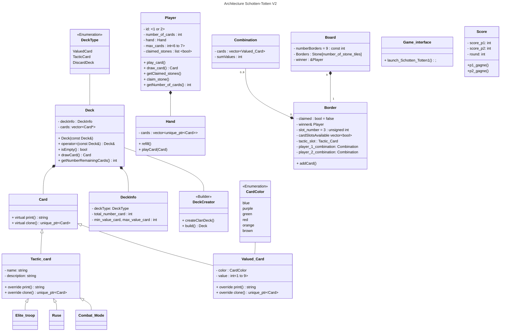

# Big Schotten-Totten

# Sommaire :

- [Liens utiles](#Liens-utiles)
- [UML](#uml-version-2)
- [Utilisation de Git](#Git)

## Liens utiles

- Le [Trello de l'équipe](https://trello.com/b/XQj4rIn7/shotten-totten "Trello LO21")
- Le [Rapport n°1](https://fr.overleaf.com/project/6419a39393e938ac5e40ea3e)(Overleaf)
- Le [Lien UML](https://codimd.math.cnrs.fr/miJRpGXeRKuiDBEZmn28rw?edit)  
**Ressources :**  
- [Refactoring guru](https://refactoring.guru) Explications BD des **designs patterns** et des **bonnes pratiques** du refactoring AKA *"comment écrire du **clean code**" ?* 
- [Grepper](https://www.grepper.com) : Extension web qui donne des petites solutions de code dans le navigateur (Faire ses recherches en anglais)  
      
  

## UML version 2



[voir UML version 1](documentation/UML.md)  
  


## Git

>Voici un petit guide de **git**. Il n'est pas exhaustif et pas parfait (ne pas hésiter à le modifier)

Ptit conseil : Bien lire ce que git nous dit quand ça marche pas, il propose souvent les solutions au problème avec les bonnes commandes à copier-coller.  

### Installer le projet :
`git clone https://github.com/kilaposhi/Schotten-Totten.git` : Pour copier le repository sur vos machines depuis un terminal comme **git bash**.  
Si vous utilisez Clion, (Ou Visual Studio Code aussi surement), vous pouvez directement faire un nouveau projet depuis un contrôle de version ("**Create project from Version Control**").

### Bases : `add`, `commit`, `push` ...

- `git pull (origin) (branchName)` : Récupère le code sur le remote repository. `(arg)` sont optionnels.  
  `origin` est une variable *par défaut* qui désigne l'URL du remote repo (`origin == "https://github.com/kilaposhi/Shotten-Totten.git"`).  
  `branchName` : Le nom de la *remote branch* que l'on veut récupérer, par défaut la même branche que celle où l'on se trouve. (voir [branch](#branch-))  
  
 **Philosophie des commits** : Pour la clarté, un commit  doit faire **une seule** tâche, avec un message court.   
   
- `git add <files>` : Ajoute des fichiers modifiés à l'index, (en : *staged*). L'index contient les changements qui vont être `commit`.
- `git status` : **A faire AVANT de `commit`**, montre les changements *staged*, et *not staged* sur la *current branch*. Les changements *staged* vont être commit
- `git reset <files>` : Enlève les fichiers de l'index pour éviter de les commits
- `git commit -m "Message court qui explique la tâche que l'on commit"` : Créer un commit avec l'index (les *staged files*)
- `git push (origin) (branchName)` : On partage nos modifications (le `commit`) au *remote repository* (`origin`)

**Exemple de bonnes utilisation**:
  ```bash
  git add ./README
  git commit -m "Update Git section" 
  git push 
  ```
  ```bash
  git add src/Card/   # Ajoute tous les fichiers du directory Valued_Card à l'index
  git reset src/Card/testCard.cpp # On ne veut commit que la classe Valued_Card
  git status  # On vérifie que l'on va commit uniquement Valued_Card.cpp et Valued_Card.h
  git commit -m "Create Card class"
  git push 
  ```

### Branch :
- `git branch` : Liste les branches **locales** et indique sur quelle branche vous êtes avec `*` (ex: `* main`)
- `git pull origin <remoteBranch>` : `pull` une branche du *remote repository* (le github) en local, une *remote branch* (ex : `git pull origin lilian` )
- `git checkout <branchName>`: Changer de branche
- `git checkout -b <newBranchName>`: Créer une nouvelle branche

Les branches git sont différentes versions du projets.    
Lorsque l'on veut coder quelque chose :  
- Créer une nouvelle branche
- Coder, et vérifier que tout fonctionne (le projet compile)
- Avant de `push`, la branch doit être à jour : `git pull main` (met à jour avec la branche `main` => `merge` la *remote branch* main avec la *current branch* ), ou `git pull` si quelqu'un modifie la même branche que vous modifiez.
  Ainsi on règle les conflits en local.
- `git push (origin) (branchName)` : Après avoir `push` la branch sur le *remote repository*, on pourra créer une **PR (Pull Request)** avec la branche main.

La branche `main` est **protégée**,  cela veut dire que personne ne peut **push** quoi que ce soit sur la branche `main`. Il faut obligatoirement créer une **PR** pour `merge` une branche sur `main`.   
La PR, indique aux autres collaborateurs les **changements** faits par la **PR**. On peut aussi en discuter, et **critiquer** le code produit pour l'améliorer (écrire du code est différent de lire celui de quelqu'un d'autre).  

### Le fichier`.gitignore` :
- Créer un fichier `.gitignore` (ou modifier celui existant) dans lequel on écrira les `path` des fichiers et des directory que `git` doit ignorer et ne jamais sauvegarder (ne jamais commit).    
Exemple de `.gitignore` pour mon cas où j'utilise l'IDE Clion :
```
cmake-build-debug/
CMakeLists.txt
.idea/
```
 **Pourquoi git doit ignorer des fichiers:** D'une manière générale on met principalement le **code source** sur git.     
         
 Comme le repository github est **public**, tout le monde pourrait accéder à notre projet. Comme on ne veut pas que le monde ait accès à nos fichiers de config pour des questions de sécurité, on utilise `.gitignore`.   
#### Exemples de fichiers à indiquer dans le `.gitignore` :  
- Fichiers de configurations spécifique à l'IDE ou à l'OS  
- Fichiers contenant des logins, mots de passe pour une BDD, token d'API...
- Les Logs : Servent à débugger, changent tout le temps... 
- Librairies : ce sont des fichiers lourds qu'on ne modifie jamais
- Exécutables, fichiers binaires : Ne sert à rien de les sauvegarder et cause des conflits facilements

>**Remarque :** Une fois qu'un fichier a été `push` sur le repository publique il est très dur de le faire disparaitre totalement, c'est pour cela que l'on prend des précautions.

