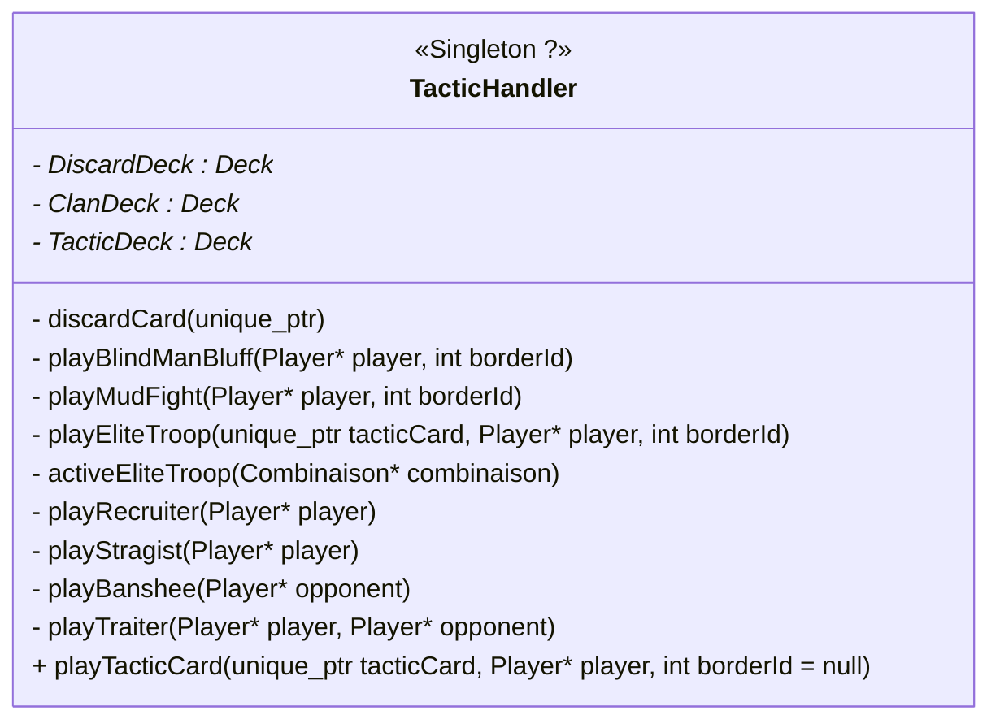

# Projet Global :
### Important :
- [ ] Mettre tout le code dans un namespace `Shotten_Totten`.
Permet d'éviter les collisions de noms avec les librairies du C 
- [ ] Faire les classes d'exceptions pour chaques classes

- [x] Faire le Rapport 2

##### Cliquer pour les taches [Optionnelles](#optionnel)

## Tactic Card :

- **Combat Mode**
  Modifie **une** Border :
    - MudFigth : `Border::setMaxNumCards(4)`
    - BlindMan's Bluff : `Border::setSumFlag(true)` "ClaimBorder se fait que par somme"

- **Elite Troop**
  Se joue dans 1 Border pour 1 combinaison
  Effet se déclenche au moment de `claimBorder()`

- **Ruses**
  Se joue sur la défausse :
    - Recruiter : Copie de la main du player, draw 3 card de `ClanDeck`, et demander au joueur de discard 2 card de cette main, puis on modifie la main du player.
    - ...
> On copie la main parce que on peut pas autoriser le player à avoir plus de 7 cartes. La copie permet d'avoir temporairement une fausse main avec 9 cartes


Ce que je propose :
- plutôt que vérifier si c'est une `ValuedCard` ou une `TacticCard` dans `Border`, on le fait dans `Player` avant, et soit on joue normalement, soit on joue dans le TacticHandler

- `playEliteTroopCard`, set un attribut bool `hasTacticCard` de combinaison à `true`. Comme ça dans la méthode `claimBorder` on a :
   ``` c++
   if(hasTacticCard)
		TacticHandler::activeEliteTroop(&combi);
    ``` 
	Avec `activeEliteTroop` qui demande au bon Player quelle carte il veut et remplace la carte Tactique Elite Troop par une nouvelle `ValuedCard`
En interne `TacticHandler` regarde quelle est la `TacticCard` et choisi la bonne méthode, communique avec `Board`,...


## Classe `Player`
- [x] Coder `Hand`, la main du `Player` ?? (martin)
- [x] Coder `Player` (martin)
- [ ] Réflechir et créer un système qui permet de gérer les tours

## Classe `Border`, et `Board` :
- [x] Coder `Border` (Lili)
- [ ] Coder la fonction `compute_combination(ValuedCard)` pour calculer les combinaisons de Poker, avec plein de fonctions dans `module/` (prototypes dans la branche [combination](https://github.com/kilaposhi/Shotten-Totten/tree/combination) (Nes)
- [x] Coder `Board` (Capu)
  
- [ ] Coder `GameTracker` pour suivre l'état de la partie (quelles cartes ont été jouées et pas jouées) : (lili)
Avec 2 `Deck`, un qui contient les cartes déjà jouées (`playedCards`), et l'autre qui contient
les cartes non jouées (`remainingCards`). Cette classe sera utilisée pour calculer si la règle de `claim` une `Border`
si l'adversaire ne peut faire mieux. (lili)
  
  
- [ ] Peut-être un [*observer*](https://refactoring.guru/design-patterns/observer),
  connecté au `unique_ptr<TacticCard> tactic_slot_` de `Border`, qui lorsqu'une carte **tactique** est jouée sur le *slot*
  est traité par un `TacticHandler` qui s'occupera d'appliquer l'effet de la carte.
- [ ] Pour les effets de la carte Tactiques utilisé le [*strategy pattern*](https://refactoring.guru/design-patterns/strategy)

## Classe `Deck`, `DeckFactory`, `Card` ... :
- [x] Coder `Card` et `ValuedCard` @kilaposhi
- [x] Coder `Deck` et `DeckFactory` @kilaposhi
- [ ] Transformer `DeckFactory` en `DeckFactory` @kilaposhi
   

- [ ] Modularité `CardColor`, utiliser le nombre de couleurs avec une Enum avec beaucoup de couleur et en mettant le nombre de cartes voulu, ça utilise le bon nombre de couleurs ?
- [ ] Coder les `Tactic_card`  (construire les cartes tactiques avec un fichier XML, ou JSON)
- [ ] Implémenter `createTacticCard` de `DeckFactory`
- [ ] Créer une classe `DeckException` et vérifier les valeurs passées dans `DeckFactory`, et les exceptions de `Deck`
- [ ] Rendre modulaire le choix des couleurs des cartes dans la création des `ValuedCard`
- [ ] Créer les cartes tactiques à partir d'un fichier JSON

# class `Game_interface` : 
- [ ] Menu pour lancer le Schotten-Totten 1, et changer de versions, tactiques, les manches, les scores, etc...

# Qt class `Displayer`: (Nes)
- [ ] Créer les widgets pour cartes
- [ ] Créer le plateau


#### Optionnel
- [ ] Pour chaque fichier repenser aux `const` pour les arguments, les méthodes, les attributs, etc...
- [ ] Marquer des variables `explicit` : Interdit les conversions implicites
- [ ] Rajouter les `inline` devant les petites fonctions ( ou settings)
- [ ] Utiliser les `static_cast<T>` et `dynamic_cast<T>` au lieu des C-style cast `(int)`
- [ ] Veiller à initialiser chaque variable (mieux avec les `{}`, ex : `int max{10}` )
- [ ] Formatter le code
    - Les noms de variables :  ex `CamelCase` pour les classes et `snake_case` pour les fonctions.
    - `int attribut_` : pour attributs privés, et fonctions privées
    - Clean header files : La partie `public` avant la partie `private`
      - mettre 2 `private`, un pour les attributs, l'autre pour les fonctions
      - Toutes les fonctions sont définies dans le `.cpp` correspondant
