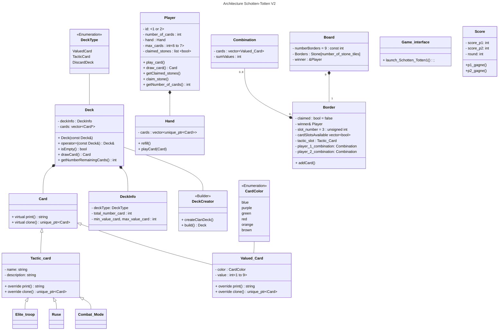
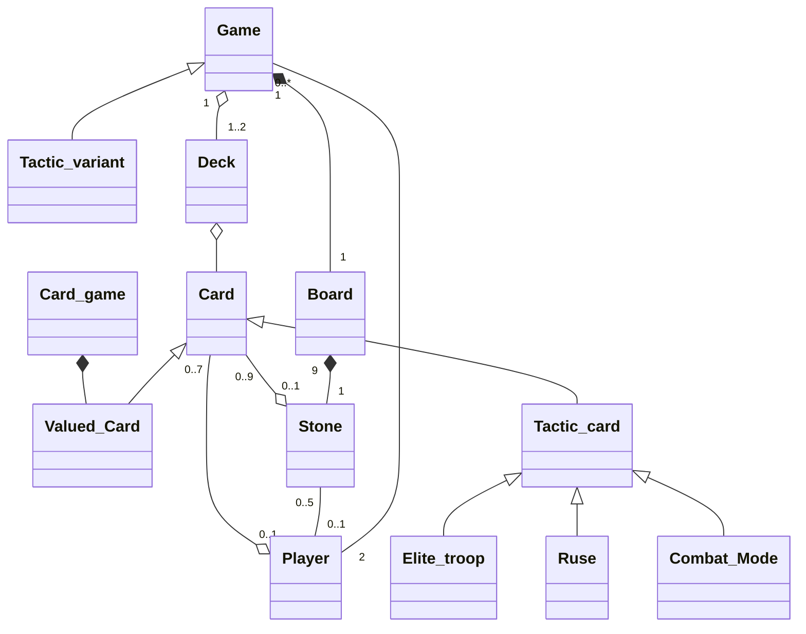

# UML version 2

### Changements :
- `Stone` devient `Border`, terme plus générique pour intégrer Schottten 1 et 2.

```mermaid
---
title: Architecture Schotten-Totten V2
---
classDiagram

%% ------ Relations
    Card <|-- Tactic_card
    Card <|-- Valued_Card
    Deck *-- Card
    Deck *-- DeckInfo
    Deck -- DeckCreator
%%    Card "0..7" --* "0..1" Hand
    Player *-- Hand
    Combination "0..9" --* "0..1" Border
    Board "9" *-- "1" Border
    Tactic_card <|-- Elite_troop
    Tactic_card <|-- Ruse
    Tactic_card <|-- Combat_Mode
    
    CardColor -- Valued_Card
    DeckType -- Deck

%%---------- class
class Game_interface {
    + launch_Schotten_Totten1();
}

class Card {
    + virtual print() string
    + virtual clone() unique_ptr~Card~
}
    

class Valued_Card{
    - color : CardColor
    - value : int<1 to 9>
    + override print() string
    + override clone() unique_ptr~Card~
}

class Tactic_card{
    - name: string
    - description: string
    + override print() string
    + override clone() unique_ptr~Card~
}

class Elite_troop {
    
}
class Ruse {
    
}
    

class Board {
    - numberBorders = 9 : const int
    - Borders : Stone[number_of_stone_tiles]
    - winner : &Player
}

class Combination{
    - cards : vector~Valued_Card~
    - sumValues : int
}
    
class Border{
    - claimed : bool = false
    - winner& Player
    - slot_number = 3 : unsigned int
    - cardSlotsAvailable vector~bool~
    - tactic_slot : Tactic_Card
    - player_1_combination: Combination
    - player_2_combination:  Combination
    + addCard()
}

class Hand {
    - cards : vector~unique_ptr~Card~~
    + refill()
    + playCard(Card)
}

class Player{
    - id: <1 or 2>
    - number_of_cards : int
    - hand : Hand
    - max_cards : int<6 to 7>
    - claimed_stones : list ~bool~
    + play_card()
    + draw_card() Card
    + getClaimed_stones() 
    + claim_stone()
    + getNumber_of_cards() int
}

class Deck{
    - deckInfo : DeckInfo
    - cards: vector~Card*~
    + Deck(const Deck&)
    + operator=(const Deck&) Deck&
    + isEmpty() bool
    + drawCard() Card
    + getNumberRemainingCards() int
}

class DeckInfo {
    - deckType: DeckType
    - total_number_card : int
    - min_value_card, max_value_card : int
}

class DeckCreator {
    <<Builder>>
    + createClanDeck() 
    + build() Deck
}
    
class Score{
- score_p1: int
- score_p2: int
- round: int
+p1_gagne()
+p2_gagne()
}


%%-------- Enum class
class CardColor {
    <<Enumeration>>
    blue
    purple
    green
    red
    orange
    brown
}
    
class DeckType{
    <<Enumeration>>
    ValuedCard
    TacticCard
    DiscardDeck
}


```

```mermaid
---
Uml simple
---
classDiagram
Card_game *-- Valued_Card
Game <|-- Tactic_variant
Card <|-- Tactic_card
Card <|-- Valued_Card
Deck o-- Card
Card "0..7" --o "0..1" Player
Card "0..9" --o "0..1" Stone
Stone "0..5" -- "0..1" Player
Game "0..*" -- "2" Player
Game "1" *-- "1" Board
Board "9" *-- "1" Stone
Game "1" o-- "1..2" Deck
Tactic_card <|-- Elite_troop
Tactic_card <|-- Ruse
Tactic_card <|-- Combat_Mode

```