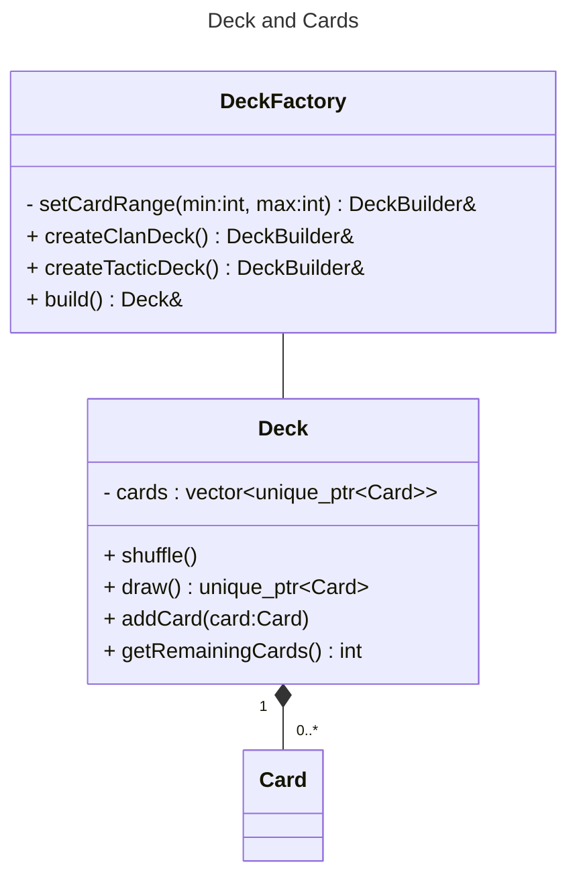
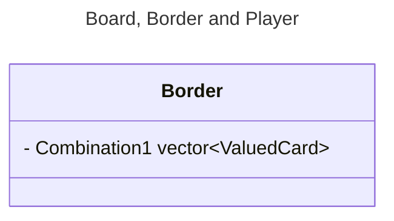
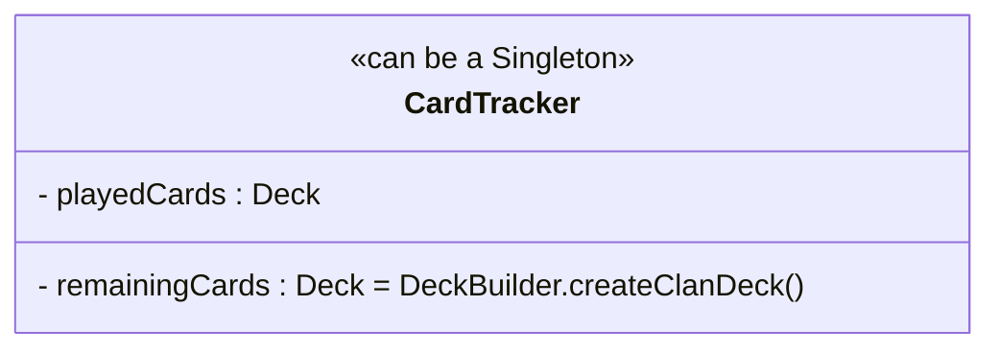

On utilisera `Deck`  avec les cartes `vector<unique_ptr<Card>>`, des `.move()` pour changer les cartes de place (dans les `Hand`,...)
- Utilisation de `DeckBuilder` pour les différents `Deck` [Builder pattern](https://refactoring.guru/design-patterns/builder)

[what's polymorphic type](https://stackoverflow.com/questions/2032361/whats-polymorphic-type-in-c)

- Observer etc pour jouer les `TacticCard` et lancer leur script
[Bonne vidéo sur les observer](https://www.youtube.com/watch?v=A_MsXney3EU)


- renommer `Stone` en `Border`
- On rajoute un cast de `unique_ptr<Card>` vers `unique_ptr<ValuedCard>` [stackoverflow](https://stackoverflow.com/questions/17417848/stdunique-ptr-with-derived-class) , pour interdire de jouer des `TacticCard` sur les bornes.







**Fonctionnement de la règle de claimed by completion**
- Un listener des `Border` pour l'écoute des nouvelles cartes. Création d'un deck du même type que le jeu actuel pour savoir quel cartes ont été joué 


- Inconvénient 2 fois plus de `Card` (-- memoire), plus rapide car pas besoin d'itérer sur le Singleton `Jeu`, et moins de couplage avec cette classe, plus de modularité etc...


# Réflexions architectures

En élaborant notre architecture, comme nous sommes nouveau à la programmation orienté objet, naturellement nous nous sommes inspirés de l'exemple de jeu de cartes vu en TD, le **set**. 

Nous avons donc créé un Singleton `Card_game` dont la seule responsabilité est de créer les cartes dynamiquement, de les libérer de la mémoire.  

Cependant pour le Schotten-Totten cela pose plusieurs problèmes.
- On s'attend  à créer au moins 2 jeux de cartes, les *cartes tactiques* et *cartes clan*. De plus si l'on pense à l'implémentation du Schotten-Totten 2 ou d'un autre jeu de cartes, on voudrait pouvoir créer des jeux différents : Pour le Schotten-Totten 2 il y a 60 cartes *valuées* (comme les cartes clans) avec des valeurs allant de 0 à 11 et avec 5 couleurs.
  
  Donc on a rendu le Singleton `Card_game` instanciable avec des paramètres pour créer différents jeux de cartes normales dans cette [Pull Request](https://github.com/kilaposhi/Schotten-Totten/pull/3)
- Mais l'utilisation de ce Singleton me parait pas claires, et pas intuitive, bref un mauvais design. C'est bizarre d'avoir une classe qui crée les cartes, et tous les objets restant du jeu qui se passe des références de cartes du Singleton. 
- Dans le Set l'intérêt du Singleton `Jeu` et que sa seule responsabilité est de créer les cartes et les rendre disponible à toutes les classes (comme une variable globale). 
-  En effet intuitivement on voudrait créer directement la pioche et les cartes en même temps (d'ailleurs en anglais pioche se dit *deck* et jeu de cartes aussi !).
### Créer les cartes en même temps que la pioche.

- Cela implique que toutes les classes comme `Player`, `Border` etc compose toutes la classe `Card`, cartes qui sont alloués dynamiquement, donc toutes les classes doivent pouvoir libérer la mémoire de ses cartes. 
  **Solution :** On utilisera les *smart pointers* de type `unique_ptr<Card>` qui gèrent la mémoire automatiquement et la libèrent forcément à la destruction de l'objet, ou même lors d'une exception. 
  On utilisera les méthodes `move()`, `reset()`, etc pour changer le propriétaire des cartes.

### Pourquoi l'allocation dynamique ?

Question légitime car rajoute de la complexité,  moins lisible, etc. 

Réponse : Le **polymorphisme**
Dans le cas de `Deck`, il contient des `Card`. Pour pouvoir faire des `Deck` de sous classes de `Card`, il faut utilise l'allocation dynamique : 
```C++
BaseClass* base = new DerivedClass();
Card* card = new ValuedCard(1, CardColor::red);
```

