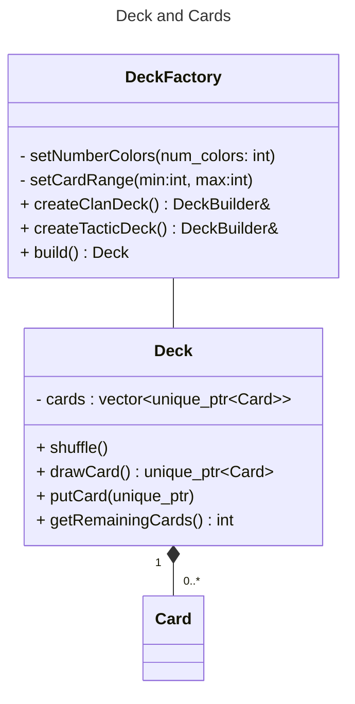
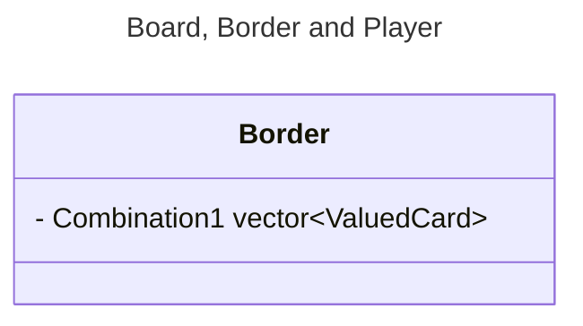
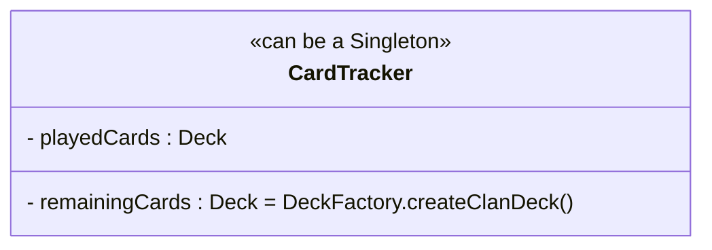

 
Rapport 2

Les objectifs de ce jalon résident dans la finalisation de l'architecture du jeu et dans l'implémentation d'une partie des modules.

**Les tâches de code effectuées sont les suivantes **

Nous avons dans un premier temps fini l'UML, cela a pris plusieurs heures : 

Par ailleurs, nous avons également avancé sur l'implémentation des différentes classes :

**Classe Player**

 Coder Hand, la main du Player ?? (martin)
 Coder Player (martin)
 Réflechir et créer un système qui permet de gérer les tours
Classe Border, et Board :
 Coder Border (Lilian)

 Coder la fonction compute_combination(ValuedCard) pour calculer les combinaisons de Poker, avec plein de fonctions dans module/ (prototypes dans la branche combination (Nes : cela a pris 2 heures, cette tâche demande le fonctionnement de la classe Card et de ses accesseurs et opérateurs notamment, certains opérateurs ont du être ajoutés,)

 Coder Board (Capu)

 Coder GameTracker pour suivre l'état de la partie (quelles cartes ont été jouées et pas jouées): Avec 2 Deck, un qui contient les cartes déjà jouées (playedCards), et l'autre qui contient les cartes non jouées ( remainingCards). Cette classe sera utilisée pour calculer si la règle de claim une Border si l'adversaire ne peut faire mieux. (Nes )

 Peut-être un observer, connecté au unique_ptr<TacticCard> tactic_slot_ de Border, qui lorsqu'une carte tactique est jouée sur le slot est traité par un TacticHandler qui s'occupera d'appliquer l'effet de la carte.

 Pour les effets de la cartes Tactiques utilisé le strategy pattern

**Classe Deck, DeckFactory, Card ... :**
 
 Coder Card et ValuedCard @kilaposhi

 Coder Deck et DeckFactory @kilaposhi

 Transformer DeckFactory en DeckFactory @kilaposhi

 modularité CardColor, utiliser le nombre de couleurs avec une Enum avec beaucoup de couleur et en mettant le nombre de cartes voulu, ça utilise le bon nombre de couleurs ?

 Coder les Tactic_card (construire les cartes tactiques avec un fichier XML, ou JSON)

 Implémenter createTacticCard de DeckFactory

 Créer une classe DeckException et vérifier les valeurs passées dans DeckFactory, et les exceptions de Deck

 Rendre modulaire le choix des couleurs des cartes dans la création des ValuedCard

 Créer les cartes tactiques à partir d'un fichier JSON

Il y a également des tâches annexes :
  - la compéhension de GIT et les cours de GIT qui a couté environ 4 heures à chaque membre du groupe, notamment Kilapang qui maitrisait déja l'outil et qui a pris le temps de l'expliquer à ses camarades
  - la rédaction du rapport qui permet de prendre du recul sur nos décisions et d'avoir une vision d'ensemble : cela a notamment pris 

On utilisera `Deck`  avec les cartes `vector<unique_ptr<Card>>`, des `.move()` pour changer les cartes de place (dans les `Hand`,...)
- Utilisation de `DeckFactory` pour les différents `Deck` [Builder pattern](https://refactoring.guru/design-patterns/builder)

[what's polymorphic type](https://stackoverflow.com/questions/2032361/whats-polymorphic-type-in-c)

- Observer etc pour jouer les `TacticCard` et lancer leur script
  [Bonne vidéo sur les observer](https://www.youtube.com/watch?v=A_MsXney3EU)


- renommer `Stone` en `Border`
- On rajoute un cast de `unique_ptr<Card>` vers `unique_ptr<ValuedCard>` pour les `Border` [stackoverflow](https://stackoverflow.com/questions/17417848/stdunique-ptr-with-derived-class) , pour interdire de jouer des `TacticCard` sur les bornes.







**Fonctionnement de la règle de claimed by completion**
- Un listener des `Border` pour l'écoute des nouvelles cartes. Création d'un deck du même type que le jeu actuel pour savoir quel cartes ont été joué


- Inconvénient 2 fois plus de `Card` (-- memoire), plus rapide car pas besoin d'itérer sur le Singleton `Jeu`, et moins de couplage avec cette classe, plus de modularité etc...


# Réflexions architectures

En élaborant notre architecture, comme nous sommes nouveaux à la programmation orienté objet, naturellement nous nous 
sommes inspirés de l'exemple de jeu de cartes vu en TD, le **set**. 

Nous avons donc créé un Singleton `Card_game`, (équivalent à `Jeu` pour le `Set`) 
dont la seule responsabilité est de créer les cartes dynamiquement, de les rendre accessible à toutes les 
classes grâce à la fonction `static` `getInstance()`, et de les libérer de la mémoire.  

Cependant, pour le Schotten-Totten cela pose plusieurs problèmes.
- On s'attend à créer au moins 2 jeux de cartes, les *cartes tactiques* et *cartes clan*. De plus si l'on pense à l'implémentation du Schotten-Totten 2 ou d'un autre jeu de cartes, on voudrait pouvoir créer des jeux différents :
Pour le Schotten-Totten 2 il y a 60 cartes *valuées* (comme les cartes clans) avec des valeurs allant de 0 à 11 et avec 5 couleurs.
  
  Donc, on a rendu le Singleton `Card_game` instantiable avec des paramètres pour créer différents jeux de cartes valuées
dans cette [Pull Request](https://github.com/kilaposhi/Schotten-Totten/pull/3)
- Mais l'utilisation de ce Singleton ne me parait pas claire, et pas intuitive. En effet, intuitivement on voudrait
créer directement la pioche et les cartes en même temps (d'ailleurs en anglais pioche se dit *deck* et jeu de cartes aussi !).
      
  Ainsi, on se passe les cartes comme dans le vrai jeu et chaque carte n'existe qu'une fois.
- C'est bizarre d'avoir une classe qui crée les cartes. Puis tous les objets restants se passent des références de cartes du Singleton. 

### Créer les cartes en même temps que la pioche.

- Cela implique que toutes les classes comme `Player`, `Border` etc composent la classe `Card`, cartes qui sont alloués dynamiquement, 
donc toutes les classes doivent libérer la mémoire de leurs cartes.  
  
  **Solution :** On utilisera les *smart pointers* de la librairie `#include <memory>`, avec le type `unique_ptr<Card>` qui gèrent la mémoire automatiquement et la libèrent forcément à la destruction de l'objet, ou même lors d'une exception. 
  On utilisera les méthodes `std::move()`, `std::reset()`, etc pour changer le propriétaire des cartes.
 
 C'est ainsi que nous avons défini l'architecture suivante :
 ---
title: Architecture Schotten-Totten V2
---
classDiagram

%% ------ Relations
Card <|-- Tactic_card
Card <|-- ValuedCard
Deck "1"*-- "0..*" Card
Deck "1" *-- "1" DeckInfo
Deck -- DeckFactory
%%    Card "0..7" --* "0..1" Hand
  Player "1"*--"1" Hand
  Combination "1" --* "2" Border
  Board "1" *-- "9" Border
  Tactic_card <|-- Elite_troop
  Tactic_card <|-- Ruse
  Tactic_card <|-- Combat_Mode
  CardColor -- ValuedCard
  DeckType -- Deck

%%---------- class
  class Game_interface{
    + launch_Schotten_Totten1();
  }

  class Card {
    + virtual print() string
    + virtual clone() unique_ptr~Card~
  }


  class ValuedCard{
    - color : CardColor
    - value : int<1 to 9>
    + ValuedCard(Card*)
    + ValuedCard(Card&)
    + ValuedCard(unique_ptr<Card>)
    + override print() string
    + override clone() unique_ptr~Card~
  }

  class Tactic_card{
    - name: string
    - description: string
    + override print() string
    + override clone() unique_ptr~Card~
  }


  class Board {
    - numberBorders = 9 : const int
    - Borders : Stone[number_of_stone_tiles]
    - winner : &Player
  }

  class Combination{
    - cards : vectorValuedCard
    - sumValues : int
  }

  class Border{
    - claimed : bool = false
    - winner* Player
    - slot_number = 3 : unsigned int
    - cardSlotsAvailable vector~bool~
    - tactic_slot : Tactic_Card
    - player_1_combination: Combination
    - player_2_combination:  Combination
    + addCard()
  }

  class Hand {
    - cards : vector~unique_ptr~Card~~
    + refill()
    + playCard(Card)
  }

  class Player{
    - id: <1 or 2>
    - number_of_cards : int
    - hand : Hand
    - max_cards : int<6 to 7>
    - claimed_stones : list ~bool~
    + play_card()
    + draw_card() Card
    + getClaimed_stones()
    + claim_stone()
    + getNumber_of_cards() int
  }

  class Deck{
    - deckInfo : DeckInfo
    - cards: vector~Card*~
    + Deck(const Deck&)
    + operator=(const Deck&) Deck&
    + isEmpty() bool
    + drawCard() Card
    + getNumberRemainingCards() int
  }

  class DeckInfo {
    - deckType: DeckType
    - total_number_card : int
    - min_value_card, max_value_card : int
  }


class DeckFactory {
  <<Factory>>
  - setRangeValue(min_value: int, max_value: int)
  - setNumberColors(num_colors: int)
  - createValuedCard()
  - build() Deck
  + createClanDeck() Deck
  + createTacticDeck() Deck
  }

  class Score{
    - score_p1: int
    - score_p2: int
    - round: int
    +p1_gagne()
    +p2_gagne()
  }


%%-------- Enum class
  class CardColor {
    <<Enumeration>>
    blue
    purple
    green
    red
    orange
    brown
  }

  class DeckType{
    <<Enumeration>>
    ValuedCard
    TacticCard
    DiscardDeck
  }


class Combination{
  <<Enumeration>>
  ColorRun
    Run
    Color
    ThreeOfAKind
    Sum
}
 
### Pourquoi l'allocation dynamique ?

Question légitime, car rajoute de la complexité, moins lisible, besoin de comprendre les pointeurs, etc. 

1. **La durée de vie** : On veut pouvoir se passer les `Card` (en réalité les `unique_ptr<Card>`) même si elle n'ont pas été crées au même endroit.
  
  
2. Le **polymorphisme**
Dans le cas de `Deck`, il contient des `Card`. Pour pouvoir faire des `Deck` de sous classes de `Card` (comme `ValuedCard` et `TacticCard`), il faut utiliser l'allocation dynamique, Exemple :
    ```cpp
    // Allocation dynamique :
    BaseClass* base = new DerivedClass();
    // Polymorphisme avec allocation dynamique :
    Card* valued_card = new ValuedCard(1, CardColor::red);

    // Besoin de libérer la mémoire
    delete card;
    delete valued_card;
    ```
    Avec les ***smart pointers*** on a :
    ```C++
    // Alloc dynamique classique
    int* dynamic_int = new int(1);
    // Alloc dynamique avec unique_ptr :
    #include <memory> // Lib pour les smarts pointer 
    std::unique_ptr<int> dynamic_int = std::make_unique<int>(1);
    // Plus besoin de libérer la mémoire

    // polymorphisme :                                       
    std::unique_ptr<Card> valued_card = std::make_unique<ValuedCard>(3, CardColor::red);
    std::unique_ptr<Card> tactic_card = std::make_unique<TacticCard>(Tactic::Joker);

    using std::unique_ptr, std::make_unique, std::move; // pour ne pas mettre de `std::`
    //Pour changer le owner d'un unique_ptr 
    unique_ptr<Card> new_card = move(valued_card); 
    ```
   Pour les **tableaux dynamiques**, on utilisera les `vector`
    ```C++
    // Plutôt que les C-like dynamic array :
    Card** cards = new Card*[54];
   // On préférera les `std:vector` :
   #include <vector>
   using std::vector;
   vector<Card*> cards;
   // avec les `unique_ptr` :
   vector<unique_ptr<Card>> cards;
    ```
###Vecteur de cartes
 Dans la classe Border nous avons choisi de mettre les ensembles de cartes dans des vecteurs puisque ces derniers ont des méthodes très pratiques que nous pouvons réutiliser
  
  
**Organisation et Cohésion du groupe**
 
  Cette partie du semestre est assez mouvementée avec l'accumulation des projets, les médians, etc. Il est donc facile de se retrouver submerger et de prendre du retard dans son travail. Nous avons tenté de compenser ce retard en tentant de commencer tôt le projet. Cependant, même avec cette tentative d'organisation il a été compliqué que chacun reste constant dans son travail. L'hétéroginété du groupe a été très utile. En effet, les différences de niveau étaient comblées par les facilités des uns qui leur ont permis de prendre le temps d'expliquer. Les connaissances de Kilapang sur Github ont notamment été utilses à tout le groupe puisque ces dernières ont été patiemment partagées et expliquées pour permettre à chacun de comprendre l'outil et de l'utiliser au mieux. Par ailleurs, cet outil permet de voir l'avancée du travail des autres de manière régulière et de s'aider et de se corriger mutuelement en cas de besoin. La relecture du programme étaiit une partie considérable du travail. Elle était d'une part essentielle à la qualité du projet puisqu'on ajoute généralement des corrections pertinentes grâce au recul de la lecture extérieure. Mais elle également cruciale au fonctionnement du projet puisque la plupart des classes et leurs méthodes s'influent entre elles
